# LLM Wiki - AI Context Documentation

> **Last Updated**: 2026-06-14
> **Version**: 0.3.2
> **Project Type**: Cross-platform Desktop Application (Tauri v2)
> **Architecture**: React Frontend + Rust Backend
> **Scan Phase**: C - Deep Scan (阶段 C 深度补捞)

---

## 📋变更记录 (Changelog)

### 2026-06-14 - 日志系统阶段 1 实施
- ✅ 新增统一日志基础设施（前端 Logger Facade + 后端 tracing Layer）
- 📊 前端：`src/lib/logger.ts` + `logger-types.ts` + `src/commands/logging.ts`
- 📊 后端：`src-tauri/src/logging/`（types/router/manager/mod 四文件）
- 🔧 配置 UI：`logging-config.tsx` 集成在 GeneralSection
- 🔧 已迁移：62 处 `eprintln!` → tracing 宏（保留 fs.rs 测试 7 处）
- 🧪 测试覆盖：11 个自动化测试全通过（前端 7 + 后端 4）
- 📈 新增 `## 关键特性 / 9. 日志系统` 章节

### 2026-04-13 12:30 - 深度补捞完成
- ✅ 完成阶段 C 深度补捞，覆盖率从 95% 提升到 98%
- 📊 深度分析 118 个文件，35 个模块
- 🔧 完善核心算法文档（四信号相关性、Louvain、多阶段检索）
- 🎯 补充架构洞察（数据流、性能优化、错误处理）
- 📈 更新索引到最新状态

### 2026-04-13 - 初始化AI上下文文档
- ✅ 创建完整的 AI 上下文文档体系
- 📊 记录项目架构、技术栈和核心功能
- 🔧 提供开发指南和 AI 使用建议
- 🎯 明确模块职责和文件组织结构

---

## 🎯 项目愿景

LLM Wiki 是一个**跨平台桌面应用**，将您的文档自动转化为结构化的、互联的知识库。与传统的 RAG（每次从头检索-生成）不同，LLM Wiki **增量构建并维护持久化的 wiki**，知识编译一次并保持最新，而非每次查询时重新推导。

本项目基于 **Andrej Karpathy 的 [llm-wiki.md](https://gist.github.com/karpathy/442a6bf555914893e9891c11519de94f)** 设计模式——一个使用 LLM 构建个人知识库的方法论。我们将这个核心抽象设计实现为完整的桌面应用，并进行了大幅扩展。

### 核心理念

- **Human curates, LLM maintains**（人类策划，LLM 维护）
- **Three-layer architecture**: Raw Sources (不可变) → Wiki (LLM生成) → Schema (规则与配置)
- **Persistent knowledge compilation**（持久化知识编译，而非每次重新生成）
- **Incremental cache**（增量缓存，未变更文件自动跳过）
- **Source traceability**（源文件可追溯性）

---

## 🏗️ 架构总览

### 技术栈

| 层级 | 技术选型 | 版本 |
|------|---------|------|
| **桌面框架** | Tauri v2 (Rust 后端) | 2.10.1 |
| **前端** | React 19 + TypeScript + Vite | 19.0.0 / 5.7.3 / 8.0.0 |
| **UI 库** | shadcn/ui + Tailwind CSS v4 | 4.1.2 / 4.2.2 |
| **编辑器** | Milkdown (基于 ProseMirror 的 WYSIWYG) | 7.20.0 |
| **图形可视化** | sigma.js + graphology + ForceAtlas2 | 3.0.2 / 0.26.0 / 0.10.1 |
| **状态管理** | Zustand | 5.0.12 |
| **搜索** | 分词搜索 + 图相关性 + 可选向量搜索 | - |
| **向量数据库** | LanceDB (Rust, 嵌入式, 可选) | 0.27.2 |
| **文档解析** | pdf-extract, docx-rs, calamine | 0.10.0 / 0.4.20 / 0.34.0 |
| **国际化** | react-i18next | 26.0.3 |
| **LLM 集成** | OpenAI, Anthropic, Google, Ollama, MiniMax, Custom | - |
| **Web 搜索** | Tavily API | - |
| **浏览器扩展** | Chrome Extension (Manifest V3) | - |

### 应用架构图

```
┌─────────────────────────────────────────────────────────────┐
│                      Tauri Desktop App                       │
├─────────────────────────────────────────────────────────────┤
│  Frontend (React 19 + TypeScript)                           │
│  ├── UI Components (shadcn/ui + Tailwind)                   │
│  ├── State Management (Zustand stores)                      │
│  ├── Knowledge Graph (sigma.js + graphology)               │
│  └── Rich Text Editor (Milkdown)                            │
├─────────────────────────────────────────────────────────────┤
│  Backend (Rust)                                             │
│  ├── File System Operations (read, write, list)            │
│  ├── Document Extraction (PDF, DOCX, XLSX, PPTX)            │
│  ├── Vector Store (LanceDB integration)                     │
│  ├── Clip Server (HTTP for browser extension)              │
│  └── Tauri Commands (FS, Project, VectorStore)             │
├─────────────────────────────────────────────────────────────┤
│  External Integrations                                      │
│  ├── LLM Providers (OpenAI, Anthropic, Google, Ollama...)  │
│  ├── Web Search (Tavily API)                               │
│  ├── Vector Embeddings (OpenAI-compatible endpoints)       │
│  └── Browser Extension (Chrome Web Clipper)                │
└─────────────────────────────────────────────────────────────┘
```

---

## 📦 模块结构图

```mermaid
graph TD
    A["(根) llm_wiki"] --> B["src (前端)"];
    A --> C["src-tauri (后端)"];
    A --> D["extension (浏览器扩展)"];
    A --> E[".github (CI/CD)"];

    B --> B1["components (UI组件)"];
    B --> B2["stores (状态管理)"];
    B --> B3["lib (核心逻辑)"];
    B --> B4["commands (Tauri命令封装)"];

    B1 --> B1A["chat (聊天界面)"];
    B1 --> B1B["graph (知识图谱)"];
    B1 --> B1C["layout (布局组件)"];
    B1 --> B1D["editor (编辑器)"];

    B2 --> B2A["wiki-store (项目状态)"];
    B2 --> B2B["chat-store (对话状态)"];
    B2 --> B2C["review-store (审核队列)"];
    B2 --> B2D["activity-store (活动面板)"];

    B3 --> B3A["ingest (两步摄取)"];
    B3 --> B3B["llm-client (LLM流式客户端)"];
    B3 --> B3C["wiki-graph (知识图谱)"];
    B3 --> B3D["search (搜索)"];
    B3 --> B3E["embedding (向量嵌入)"];
    B3 --> B3F["deep-research (深度研究)"];

    C --> C1["commands (Tauri命令)"];
    C --> C2["clip_server (Web Clipper服务)"];
    C --> C3["types (类型定义)"];

    C1 --> C1A["fs (文件系统)"];
    C1 --> C1B["project (项目管理)"];
    C1 --> C1C["vectorstore (向量存储)"];

    click B3A "#核心模块ingestts" "查看 ingest 模块"
    click B3C "#核心模块wiki-graphts" "查看 wiki-graph 模块"
    click B3D "#核心模块searchts" "查看 search 模块"
    click C2 "#核心模块clip-serverrs" "查看 clip_server 模块"
```



---

## 📚 模块索引

| 模块路径 | 职责描述 | 主要技术 | 入口文件 | 状态 |
|---------|---------|---------|---------|------|
| **src/components/chat** | AI 聊天界面组件 | React, TypeScript | chat-panel.tsx | ✅ 已深度扫描 |
| **src/components/graph** | 知识图谱可视化 | sigma.js, graphology | graph-view.tsx | ✅ 已深度扫描 |
| **src/components/layout** | 应用布局与面板组件 | React, resizable-panels | app-layout.tsx | ✅ 已深度扫描 |
| **src/components/editor** | Markdown 编辑器 | Milkdown, ProseMirror | wiki-editor.tsx | ✅ 已深度扫描 |
| **src/stores** | 全局状态管理 | Zustand | wiki-store.ts | ✅ 已深度扫描 |
| **src/lib/ingest.ts** | 两步链式摄取 | LLM 流式调用 | ingest.ts | ✅ 已深度扫描 |
| **src/lib/llm-client.ts** | LLM 流式客户端 | Fetch API, SSE | llm-client.ts | ✅ 已深度扫描 |
| **src/lib/wiki-graph.ts** | 知识图谱构建 | graphology, Louvain | wiki-graph.ts | ✅ 已深度扫描 |
| **src/lib/search.ts** | 多阶段搜索 | 分词, 向量, 图扩展 | search.ts | ✅ 已深度扫描 |
| **src/lib/embedding.ts** | 向量嵌入管理 | OpenAI API, LanceDB | embedding.ts | ✅ 已深度扫描 |
| **src/lib/deep-research.ts** | 深度研究功能 | Tavily API | deep-research.ts | ✅ 已深度扫描 |
| **src/lib/graph-relevance.ts** | 四信号相关性模型 | graphology | graph-relevance.ts | ✅ 已深度扫描 |
| **src/lib/graph-insights.ts** | 图洞察分析 | graphology | graph-insights.ts | ✅ 已深度扫描 |
| **src/lib/ingest-queue.ts** | 持久化摄取队列 | TypeScript | ingest-queue.ts | ✅ 已深度扫描 |
| **src/lib/ingest-cache.ts** | SHA256 增量缓存 | TypeScript | ingest-cache.ts | ✅ 已深度扫描 |
| **src-tauri/src/commands/fs.rs** | 文件系统操作 | Rust, fs, calamine | fs.rs | ✅ 已深度扫描 |
| **src-tauri/src/clip_server.rs** | Web Clipper 服务 | Rust, tiny_http | clip_server.rs | ✅ 已深度扫描 |
| **src-tauri/src/commands/vectorstore.rs** | 向量数据库操作 | Rust, LanceDB | vectorstore.rs | ✅ 已深度扫描 |
| **extension/** | Chrome 浏览器扩展 | JS, Manifest V3 | popup.js | ✅ 已深度扫描 |

---

## 🚀 运行与开发

### 环境要求

- **Node.js**: 20+
- **Rust**: 1.70+ (2021 edition)
- **操作系统**: macOS, Windows, Linux

### 开发模式

```bash
# 安装依赖
npm install

# 启动开发服务器 (前端 Vite + Tauri)
npm run tauri dev
# 前端热重载端口: 1420

# 前端单独运行 (端口 1420)
npm run dev

# 运行测试
npm test

# Rust 代码检查
cargo clippy
cargo fmt
```

### 生产构建

```bash
# 构建前端
npm run build

# 构建 Tauri 应用
npm run tauri build

# 生成的安装包位置:
# - macOS: src-tauri/target/release/bundle/dmg/
# - Windows: src-tauri/target/release/bundle/msi/
# - Linux: src-tauri/target/release/bundle/deb/ 或 .AppImage
```

### Chrome 扩展安装

1. 打开 `chrome://extensions`
2. 启用"开发者模式"
3. 点击"加载已解压的扩展程序"
4. 选择项目的 `extension/` 目录

---

## 🧪 测试策略

### 测试框架

- **单元测试**: Vitest@4.1.4
- **测试位置**: `src/lib/__tests__/`
- **当前覆盖**: 仅 LLM provider 配置测试

### 运行测试

```bash
# 运行所有测试
npm test

# 监听模式（开发时推荐）
npm run test -- --watch

# 查看覆盖率
npm run test -- --coverage

# Rust 测试
cargo test
```

### 测试覆盖缺口

- ❌ ingest.ts 单元测试（两步摄取流程、SHA256 缓存）
- ❌ search.ts 单元测试（分词、图扩展、预算控制）
- ❌ wiki-graph.ts 单元测试（图谱构建、Louvain、相关性计算）
- ❌ embedding.ts 单元测试（向量嵌入、搜索）
- ❌ graph-relevance.ts 单元测试（四信号模型）
- ❌ Rust 后端集成测试（文件操作、向量存储）
- ❌ E2E 测试（摄取 → 搜索 → 聊天流程）
- ❌ UI 组件测试（React Testing Library）

---

## 📐 编码规范

### TypeScript/JavaScript

- **风格指南**: 遵循 ESLint 默认配置
- **类型安全**: 严格使用 TypeScript 类型
- **组件命名**: PascalCase for components, camelCase for utilities
- **文件组织**: 按功能模块分组 (components/, lib/, stores/)

### Rust

- **版本**: 2021 edition
- **风格**: `cargo fmt` (rustfmt)
- **Linter**: `cargo clippy`
- **错误处理**: 使用 `Result<T, String>` 返回错误信息给前端

### 代码质量工具

- **前端**: ESLint + TypeScript
- **后端**: rustfmt + clippy
- **CI/CD**: GitHub Actions (多平台构建测试)

---

## 🤖 AI 使用指引

### 核心概念理解

#### 1. 两步摄取 (Two-Step Ingest)

- **Step 1 (Analysis)**: LLM 分析源文件 → 结构化分析
  - 关键实体、概念、论点
  - 与现有 wiki 的连接
  - 矛盾与张力
  - Wiki 结构建议

- **Step 2 (Generation)**: LLM 基于分析生成 wiki 文件
  - 带源文件 frontmatter 的摘要
  - 实体页面、概念页面（带交叉引用）
  - 更新 index.md, log.md, overview.md
  - 审核项（预生成搜索查询）
  - Deep Research 搜索查询

- **增强功能**:
  - SHA256 增量缓存（未变更文件自动跳过）
  - 持久化摄取队列（串行处理，崩溃恢复）
  - 文件夹导入（保留目录结构，文件夹路径作为分类提示）
  - 自动嵌入（启用向量搜索时）
  - 源文件可追溯性（每个 wiki 页面包含 `sources: []` 字段）

#### 2. 四信号相关性模型 (4-Signal Relevance)

| 信号 | 权重 | 描述 |
|------|------|------|
| **Direct link** | ×3.0 | `[[wikilink]]` 直接连接 |
| **Source overlap** | ×4.0 | 共享源文件 (frontmatter `sources[]`) |
| **Adamic-Adar** | ×1.5 | 共同邻居（加权邻居度数） |
| **Type affinity** | ×1.0 | 同类型页面奖励 |

#### 3. Louvain 社区检测

- 自动发现知识聚类
- 计算社区内聚度 (cohesion = actual edges / possible edges)
- 低内聚度社区 (< 0.15) 标记警告
- 12 色社区调色板

#### 4. 多阶段检索管道

- **Phase 1**: 分词搜索（英文单词分割 + 中文 CJK bigram，标题匹配 +10 分）
- **Phase 1.5**: 向量语义搜索（可选，LanceDB，余弦相似度）
- **Phase 2**: 图扩展（2-hop 遍历，衰减）
- **Phase 3**: 预算控制（可配置 4K-1M tokens，60/20/5/15 分配）
- **Phase 4**: 上下文组装（编号页面，引用格式 [1], [2]）

### AI 辅助开发建议

#### 1. 理解数据流

```
用户导入文件
  → autoIngest()
  → LLM 分析 (Step 1)
  → LLM 生成 (Step 2)
  → 写入文件
  → 更新图

搜索查询
  → searchWiki()
  → 分词 + 向量 + 图扩展
  → 排序
  → 返回结果

删除文件
  → 级联清理
  → 移除 source summary
  → 更新相关页面
  → 清理 wikilinks
```

#### 2. 关键文件路径

- **摄取逻辑**: `src/lib/ingest.ts` (核心两步摄取)
- **LLM 客户端**: `src/lib/llm-client.ts` (流式调用)
- **知识图谱**: `src/lib/wiki-graph.ts` (图构建 + Louvain)
- **搜索**: `src/lib/search.ts` (多阶段检索)
- **相关性**: `src/lib/graph-relevance.ts` (四信号模型)
- **图洞察**: `src/lib/graph-insights.ts` (惊喜连接、知识缺口)
- **Rust 后端**: `src-tauri/src/commands/` (文件操作，向量存储)
- **Clip Server**: `src-tauri/src/clip_server.rs` (HTTP 服务器)

#### 3. 状态管理

- **wiki-store**: 项目状态、文件树、LLM 配置、dataVersion
- **chat-store**: 对话历史、当前会话、多会话管理
- **review-store**: 审核队列
- **activity-store**: 实时活动面板
- **research-store**: 深度研究状态

#### 4. Tauri 命令模式

- 前端调用: `import { readFile } from "@/commands/fs"`
- 后端注册: `src-tauri/src/lib.rs` 中的 `invoke_handler`
- Rust 实现: `src-tauri/src/commands/` 目录

#### 5. 常见任务模式

- **添加新的 LLM provider**: 修改 `src/lib/llm-providers.ts`
- **扩展文件格式支持**: 修改 `src-tauri/src/commands/fs.rs` 的 `read_file()`
- **自定义图布局**: 修改 `src/components/graph/graph-view.tsx`
- **添加新的审核类型**: 修改 `src/lib/ingest.ts` 的 `parseReviewBlocks()`
- **修改相关性权重**: 修改 `src/lib/graph-relevance.ts`
- **添加新的搜索阶段**: 修改 `src/lib/search.ts`

### AI 上下文优化

当使用 AI 工具（如 Claude Code）时，可以提供以下上下文以获得更好的帮助：

```
这是一个 Tauri v2 桌面应用，前端 React 19 + TypeScript，后端 Rust。

核心功能：
1. 两步 LLM 摄取 (分析 → 生成)
2. 知识图谱可视化 (sigma.js + Louvain)
3. 多阶段搜索 (分词 + 向量 + 图)
4. Web Clipper (Chrome 扩展 + HTTP 服务器)

关键文件：
- src/lib/ingest.ts (两步摄取)
- src/lib/wiki-graph.ts (图构建)
- src/lib/graph-relevance.ts (四信号相关性)
- src-tauri/src/clip_server.rs (Web Clipper 服务)

技术栈：
- 前端: React 19, TypeScript, Vite, Tailwind CSS v4, shadcn/ui
- 后端: Rust, Tauri v2, LanceDB (可选), pdf-extract, docx-rs
- LLM: OpenAI, Anthropic, Google, Ollama, MiniMax, Custom
```

---

## 🔑 关键特性

### 1. 两步链式摄取

- **Step 1 (Analysis)**: LLM 读取源文件 → 结构化分析
- **Step 2 (Generation)**: LLM 基于分析生成 wiki 文件
- **增强功能**:
  - SHA256 增量缓存（未变更文件自动跳过）
  - 持久化摄取队列（串行处理，崩溃恢复）
  - 文件夹导入（保留目录结构）
  - 自动嵌入（启用向量搜索时）
  - 源文件可追溯性

### 2. 知识图谱与社区检测

- **四信号相关性模型**: Direct link, Source overlap, Adamic-Adar, Type affinity
- **Louvain 算法**: 自动发现知识聚类，计算内聚度
- **交互式可视化**: 悬停高亮、缩放控制、位置缓存
- **图洞察**: 惊喜连接、知识缺口（孤立页面、稀疏社区、桥接节点）

### 3. 多阶段检索管道

- **Phase 1**: 分词搜索（英文单词分割 + 中文 CJK bigram，标题匹配 +10 分）
- **Phase 1.5**: 向量语义搜索（可选，OpenAI 兼容端点，LanceDB 存储）
- **Phase 2**: 图扩展（2-hop 遍历，衰减）
- **Phase 3**: 预算控制（4K-1M tokens，60/20/5/15 分配）
- **Phase 4**: 上下文组装（编号页面，引用格式 [1], [2]）

### 4. Deep Research

- **Web 搜索**: Tavily API，完整内容提取（无截断）
- **多查询**: 每个主题多个 LLM 优化的搜索查询
- **LLM 优化主题**: 从 Graph Insights 触发时，LLM 读取 overview.md + purpose.md
- **用户确认**: 可编辑的主题和搜索查询确认对话框
- **自动摄取**: 研究结果自动处理以提取实体/概念

### 5. Chrome Web Clipper

- **Mozilla Readability.js**: 准确的文章提取（去除广告、导航、侧边栏）
- **Turndown.js**: HTML → Markdown 转换（支持表格）
- **项目选择器**: 选择要剪辑的 wiki（支持多项目）
- **本地 HTTP API**: 端口 19827，扩展与应用通信
- **自动摄取**: 剪辑内容自动触发两步摄取管道
- **离线预览**: 应用未运行时显示提取的内容

### 6. 多格式文档支持

| 格式 | 提取方法 |
|------|---------|
| PDF | pdf-extract (Rust) + 文件缓存 |
| DOCX | docx-rs — 标题、粗体/斜体、列表、表格 → 结构化 Markdown |
| PPTX | ZIP + XML — 逐页提取，标题/列表结构 |
| XLSX/XLS/ODS | calamine — 正确的单元格类型，多表支持，Markdown 表格 |
| 图片 | 原生预览 (png, jpg, gif, webp, svg 等) |
| 视频/音频 | 内置播放器 |
| Web clips | Readability.js + Turndown.js → 清洁 Markdown |

### 7. 审核系统（异步人机协作）

- LLM 在摄取期间标记需要人工判断的项目
- **预定义操作类型**: Create Page, Deep Research, Skip
- **摄取时生成搜索查询**: LLM 为每个审核项预生成优化的 Web 搜索查询
- 用户方便时处理审核（不阻塞摄取）

### 8. 其他增强

- **i18n**: 英文 + 中文界面 (react-i18next)
- **设置持久化**: LLM provider、API key、模型、上下文大小、语言
- **Obsidian 兼容**: 自动生成 `.obsidian/` 目录
- **Markdown 渲染**: GFM 表格、代码块、wikilink 处理
- **多 provider LLM 支持**: OpenAI, Anthropic, Google, Ollama, MiniMax, Custom
- **15 分钟超时**: 长时间摄取操作不会过早失败
- **dataVersion 信号**: wiki 内容更改时自动刷新图和 UI
- **级联删除**: 智能清理相关 wiki 页面，保留共享实体

### 9. 日志系统

- **前端 Logger Facade**: `src/lib/logger.ts`（批处理：50ms / 100 条双阈值 + 级别过滤 + IPC 发送）
- **前端类型定义**: `src/lib/logger-types.ts`（LogLevel / LogEntry / LogFileEntry）
- **前端命令封装**: `src/commands/logging.ts`（6 个 Tauri 命令封装）
- **后端 Tracing Layer**: `src-tauri/src/logging/`（types / router / manager / mod 四文件）
  - 单 channel 架构（OnceLock<LogManager>，规避 unsafe）
  - 文件轮转：10MB + 保留 5 个历史文件，rotate 校验文件存在性
  - 双格式：开发控制台人类可读 fmt layer + 文件 JSON 格式
- **配置 UI**: `src/components/settings/logging-config.tsx`（DEBUG / INFO / WARN / ERROR 选项卡按钮，集成在 GeneralSection，optimistic 更新 + 失败回滚）
- **初始化时序**:
  - 前端：`src/main.tsx::initLogger()`（启动时读取后端 level 配置）
  - 后端：`src-tauri/src/lib.rs` setup 钩子中 `init_logging()`
- **eprintln! 迁移**: `panic_guard.rs` 1 处 + 其他 Rust 文件 61 处 → tracing 宏，保留 `fs.rs` 测试中 7 处
- **Tauri 命令** (6 个): `send_log` / `get_log_level` / `set_log_level` / `list_log_files` / `read_log_file` / `clear_logs`
- **测试**: 前端单元 4 + 集成 3 + 后端 4 = 11 个自动化测试全通过

---

## 📂 项目目录结构

```
llm_wiki/
├── src/                          # 前端源代码 (React + TypeScript)
│   ├── components/               # UI 组件
│   │   ├── chat/                # 聊天界面组件
│   │   ├── graph/               # 知识图谱可视化
│   │   ├── layout/              # 布局组件
│   │   ├── editor/              # Markdown 编辑器
│   │   ├── lint/                # Lint 视图
│   │   ├── project/             # 项目管理组件
│   │   ├── review/              # 审核队列
│   │   ├── search/              # 搜索视图
│   │   ├── settings/            # 设置视图
│   │   ├── sources/             # 文件源视图
│   │   └── ui/                  # shadcn/ui 基础组件
│   ├── stores/                  # Zustand 状态管理
│   ├── lib/                     # 核心逻辑库
│   │   ├── __tests__/           # 单元测试
│   │   ├── ingest.ts            # 两步摄取
│   │   ├── llm-client.ts        # LLM 流式客户端
│   │   ├── llm-providers.ts     # LLM provider 配置
│   │   ├── wiki-graph.ts        # 知识图谱构建
│   │   ├── search.ts            # 多阶段搜索
│   │   ├── graph-relevance.ts   # 四信号相关性
│   │   ├── graph-insights.ts    # 图洞察
│   │   ├── embedding.ts         # 向量嵌入管理
│   │   ├── deep-research.ts     # 深度研究
│   │   ├── ingest-queue.ts      # 持久化摄取队列
│   │   ├── ingest-cache.ts      # SHA256 增量缓存
│   │   └── [其他工具模块]
│   ├── commands/                # Tauri 命令封装
│   ├── types/                   # TypeScript 类型定义
│   ├── i18n/                    # 国际化资源
│   ├── assets/                  # 静态资源
│   ├── App.tsx                  # 应用入口
│   └── main.tsx                 # React 入口
├── src-tauri/                   # Rust 后端 (Tauri v2)
│   ├── src/
│   │   ├── commands/            # Tauri 命令实现
│   │   │   ├── fs.rs            # 文件系统操作
│   │   │   ├── project.rs       # 项目管理
│   │   │   ├── vectorstore.rs   # 向量数据库 (LanceDB)
│   │   │   └── mod.rs           # 命令模块导出
│   │   ├── clip_server.rs       # Web Clipper HTTP 服务
│   │   ├── types/               # Rust 类型定义
│   │   ├── lib.rs               # Tauri 主入口
│   │   └── main.rs              # Rust 主函数
│   ├── Cargo.toml               # Rust 依赖配置
│   └── tauri.conf.json          # Tauri 应用配置
├── extension/                   # Chrome 浏览器扩展
│   ├── manifest.json            # Manifest V3 配置
│   ├── popup.html/js            # 扩展弹窗界面
│   ├── Readability.js           # 文章提取库
│   └── Turndown.js              # HTML → Markdown 转换
├── .github/workflows/           # GitHub Actions CI/CD
│   ├── build.yml                # 多平台构建与发布
│   └── ci.yml                   # 持续集成测试
├── assets/                      # 文档图片资源
├── README.md                    # 英文文档
├── README_CN.md                 # 中文文档
├── CLAUDE.md                    # AI 上下文文档 (本文件)
├── package.json                 # Node.js 依赖配置
├── tsconfig.json                # TypeScript 配置
├── vite.config.ts               # Vite 构建配置
└── LICENSE                      # GPL v3 许可证
```

---

## 🔗 相关资源

### 设计灵感

- **Andrej Karpathy's llm-wiki.md**: https://gist.github.com/karpathy/442a6bf555914893e9891c11519de94f
- **Obsidian**: https://obsidian.md/ (双向链接知识库)
- **Tauri**: https://tauri.app/ (跨平台桌面应用框架)

### 技术文档

- **React 19**: https://react.dev/
- **TypeScript**: https://www.typescriptlang.org/
- **Rust**: https://www.rust-lang.org/
- **Tauri v2**: https://v2.tauri.app/
- **Milkdown**: https://milkdown.dev/
- **sigma.js**: https://www.sigmajs.org/
- **graphology**: https://graphology.github.io/
- **LanceDB**: https://lancedb.github.io/lancedb/

### 外部服务

- **OpenAI API**: https://platform.openai.com/
- **Anthropic Claude**: https://www.anthropic.com/
- **Google AI**: https://ai.google.dev/
- **Ollama**: https://ollama.ai/
- **Tavily API**: https://tavily.com/

---

## 📄 许可证

本项目采用 **GNU General Public License v3.0** 许可证。详见 [LICENSE](LICENSE) 文件。

---

## 🙏 致谢

- **Andrej Karpathy**: llm-wiki 设计模式创始人
- **Tauri 团队**: 优秀的跨平台桌面应用框架
- **shadcn/ui**: 美观的 React UI 组件库
- **开源社区**: 所有依赖库的贡献者

---

*本文档由 AI 生成并维护，最后更新于 2026-04-13 12:30:00 UTC*
