← [CLAUDE.md](../CLAUDE.md)

## 🎯 项目愿景

LLM Wiki 是一个**跨平台桌面应用**，将您的文档自动转化为结构化的、互联的知识库。与传统的 RAG（每次从头检索-生成）不同，LLM Wiki **增量构建并维护持久化的 wiki**，知识编译一次并保持最新，而非每次查询时重新推导。

本项目基于 **Andrej Karpathy 的 [llm-wiki.md](https://gist.github.com/karpathy/442a6bf555914893e9891c11519de94f)** 设计模式——一个使用 LLM 构建个人知识库的方法论。我们将这个核心抽象设计实现为完整的桌面应用，并进行了大幅扩展。

### 核心理念

- **Human curates, LLM maintains**（人类策划，LLM 维护）
- **Three-layer architecture**: Raw Sources (不可变) → Wiki (LLM生成) → Schema (规则与配置)
- **Persistent knowledge compilation**（持久化知识编译，而非每次重新生成）
- **Incremental cache**（增量缓存，未变更文件自动跳过）
- **Source traceability**（源文件可追溯性）

---

## 🏗️ 架构总览

### 技术栈

| 层级 | 技术选型 | 版本 |
|------|---------|------|
| **桌面框架** | Tauri v2 (Rust 后端) | 2.10.1 |
| **前端** | React 19 + TypeScript + Vite | 19.0.0 / 5.7.3 / 8.0.0 |
| **UI 库** | shadcn/ui + Tailwind CSS v4 | 4.1.2 / 4.2.2 |
| **编辑器** | Milkdown (基于 ProseMirror 的 WYSIWYG) | 7.20.0 |
| **图形可视化** | sigma.js + graphology + ForceAtlas2 | 3.0.2 / 0.26.0 / 0.10.1 |
| **状态管理** | Zustand | 5.0.12 |
| **搜索** | 分词搜索 + 图相关性 + 可选向量搜索 | - |
| **向量数据库** | LanceDB (Rust, 嵌入式, 可选) | 0.27.2 |
| **文档解析** | pdf-extract, docx-rs, calamine | 0.10.0 / 0.4.20 / 0.34.0 |
| **国际化** | react-i18next | 26.0.3 |
| **LLM 集成** | OpenAI, Anthropic, Google, Ollama, MiniMax, Custom | - |
| **Web 搜索** | Tavily API | - |
| **浏览器扩展** | Chrome Extension (Manifest V3) | - |

### 应用架构图

```
┌─────────────────────────────────────────────────────────────┐
│                      Tauri Desktop App                       │
├─────────────────────────────────────────────────────────────┤
│  Frontend (React 19 + TypeScript)                           │
│  ├── UI Components (shadcn/ui + Tailwind)                   │
│  ├── State Management (Zustand stores)                      │
│  ├── Knowledge Graph (sigma.js + graphology)               │
│  └── Rich Text Editor (Milkdown)                            │
├─────────────────────────────────────────────────────────────┤
│  Backend (Rust)                                             │
│  ├── File System Operations (read, write, list)            │
│  ├── Document Extraction (PDF, DOCX, XLSX, PPTX)            │
│  ├── Vector Store (LanceDB integration)                     │
│  ├── Clip Server (HTTP for browser extension)              │
│  └── Tauri Commands (FS, Project, VectorStore)             │
├─────────────────────────────────────────────────────────────┤
│  External Integrations                                      │
│  ├── LLM Providers (OpenAI, Anthropic, Google, Ollama...)  │
│  ├── Web Search (Tavily API)                               │
│  ├── Vector Embeddings (OpenAI-compatible endpoints)       │
│  └── Browser Extension (Chrome Web Clipper)                │
└─────────────────────────────────────────────────────────────┘
```

---

## 📦 模块结构图

```mermaid
graph TD
    A["(根) llm_wiki"] --> B["src (前端)"];
    A --> C["src-tauri (后端)"];
    A --> D["extension (浏览器扩展)"];
    A --> E[".github (CI/CD)"];

    B --> B1["components (UI组件)"];
    B --> B2["stores (状态管理)"];
    B --> B3["lib (核心逻辑)"];
    B --> B4["commands (Tauri命令封装)"];

    B1 --> B1A["chat (聊天界面)"];
    B1 --> B1B["graph (知识图谱)"];
    B1 --> B1C["layout (布局组件)"];
    B1 --> B1D["editor (编辑器)"];

    B2 --> B2A["wiki-store (项目状态)"];
    B2 --> B2B["chat-store (对话状态)"];
    B2 --> B2C["review-store (审核队列)"];
    B2 --> B2D["activity-store (活动面板)"];

    B3 --> B3A["ingest (两步摄取)"];
    B3 --> B3B["llm-client (LLM流式客户端)"];
    B3 --> B3C["wiki-graph (知识图谱)"];
    B3 --> B3D["search (搜索)"];
    B3 --> B3E["embedding (向量嵌入)"];
    B3 --> B3F["deep-research (深度研究)"];

    C --> C1["commands (Tauri命令)"];
    C --> C2["clip_server (Web Clipper服务)"];
    C --> C3["types (类型定义)"];

    C1 --> C1A["fs (文件系统)"];
    C1 --> C1B["project (项目管理)"];
    C1 --> C1C["vectorstore (向量存储)"];

    click B3A "#核心模块ingestts" "查看 ingest 模块"
    click B3C "#核心模块wiki-graphts" "查看 wiki-graph 模块"
    click B3D "#核心模块searchts" "查看 search 模块"
    click C2 "#核心模块clip-serverrs" "查看 clip_server 模块"
```



---

## 📚 模块索引

| 模块路径 | 职责描述 | 主要技术 | 入口文件 | 状态 |
|---------|---------|---------|---------|------|
| **src/components/chat** | AI 聊天界面组件 | React, TypeScript | chat-panel.tsx | ✅ 已深度扫描 |
| **src/components/graph** | 知识图谱可视化 | sigma.js, graphology | graph-view.tsx | ✅ 已深度扫描 |
| **src/components/layout** | 应用布局与面板组件 | React, resizable-panels | app-layout.tsx | ✅ 已深度扫描 |
| **src/components/editor** | Markdown 编辑器 | Milkdown, ProseMirror | wiki-editor.tsx | ✅ 已深度扫描 |
| **src/stores** | 全局状态管理 | Zustand | wiki-store.ts | ✅ 已深度扫描 |
| **src/lib/ingest.ts** | 两步链式摄取 | LLM 流式调用 | ingest.ts | ✅ 已深度扫描 |
| **src/lib/llm-client.ts** | LLM 流式客户端 | Fetch API, SSE | llm-client.ts | ✅ 已深度扫描 |
| **src/lib/wiki-graph.ts** | 知识图谱构建 | graphology, Louvain | wiki-graph.ts | ✅ 已深度扫描 |
| **src/lib/search.ts** | 多阶段搜索 | 分词, 向量, 图扩展 | search.ts | ✅ 已深度扫描 |
| **src/lib/embedding.ts** | 向量嵌入管理 | OpenAI API, LanceDB | embedding.ts | ✅ 已深度扫描 |
| **src/lib/deep-research.ts** | 深度研究功能 | Tavily API | deep-research.ts | ✅ 已深度扫描 |
| **src/lib/graph-relevance.ts** | 四信号相关性模型 | graphology | graph-relevance.ts | ✅ 已深度扫描 |
| **src/lib/graph-insights.ts** | 图洞察分析 | graphology | graph-insights.ts | ✅ 已深度扫描 |
| **src/lib/ingest-queue.ts** | 持久化摄取队列 | TypeScript | ingest-queue.ts | ✅ 已深度扫描 |
| **src/lib/ingest-cache.ts** | SHA256 增量缓存 | TypeScript | ingest-cache.ts | ✅ 已深度扫描 |
| **src-tauri/src/commands/fs.rs** | 文件系统操作 | Rust, fs, calamine | fs.rs | ✅ 已深度扫描 |
| **src-tauri/src/clip_server.rs** | Web Clipper 服务 | Rust, tiny_http | clip_server.rs | ✅ 已深度扫描 |
| **src-tauri/src/commands/vectorstore.rs** | 向量数据库操作 | Rust, LanceDB | vectorstore.rs | ✅ 已深度扫描 |
| **extension/** | Chrome 浏览器扩展 | JS, Manifest V3 | popup.js | ✅ 已深度扫描 |


---

## 📂 项目目录结构

```
llm_wiki/
├── src/                          # 前端源代码 (React + TypeScript)
│   ├── components/               # UI 组件
│   │   ├── chat/                # 聊天界面组件
│   │   ├── graph/               # 知识图谱可视化
│   │   ├── layout/              # 布局组件
│   │   ├── editor/              # Markdown 编辑器
│   │   ├── lint/                # Lint 视图
│   │   ├── project/             # 项目管理组件
│   │   ├── review/              # 审核队列
│   │   ├── search/              # 搜索视图
│   │   ├── settings/            # 设置视图
│   │   ├── sources/             # 文件源视图
│   │   └── ui/                  # shadcn/ui 基础组件
│   ├── stores/                  # Zustand 状态管理
│   ├── lib/                     # 核心逻辑库
│   │   ├── __tests__/           # 单元测试
│   │   ├── ingest.ts            # 两步摄取
│   │   ├── llm-client.ts        # LLM 流式客户端
│   │   ├── llm-providers.ts     # LLM provider 配置
│   │   ├── wiki-graph.ts        # 知识图谱构建
│   │   ├── search.ts            # 多阶段搜索
│   │   ├── graph-relevance.ts   # 四信号相关性
│   │   ├── graph-insights.ts    # 图洞察
│   │   ├── embedding.ts         # 向量嵌入管理
│   │   ├── deep-research.ts     # 深度研究
│   │   ├── ingest-queue.ts      # 持久化摄取队列
│   │   ├── ingest-cache.ts      # SHA256 增量缓存
│   │   └── [其他工具模块]
│   ├── commands/                # Tauri 命令封装
│   ├── types/                   # TypeScript 类型定义
│   ├── i18n/                    # 国际化资源
│   ├── assets/                  # 静态资源
│   ├── App.tsx                  # 应用入口
│   └── main.tsx                 # React 入口
├── src-tauri/                   # Rust 后端 (Tauri v2)
│   ├── src/
│   │   ├── commands/            # Tauri 命令实现
│   │   │   ├── fs.rs            # 文件系统操作
│   │   │   ├── project.rs       # 项目管理
│   │   │   ├── vectorstore.rs   # 向量数据库 (LanceDB)
│   │   │   └── mod.rs           # 命令模块导出
│   │   ├── clip_server.rs       # Web Clipper HTTP 服务
│   │   ├── types/               # Rust 类型定义
│   │   ├── lib.rs               # Tauri 主入口
│   │   └── main.rs              # Rust 主函数
│   ├── Cargo.toml               # Rust 依赖配置
│   └── tauri.conf.json          # Tauri 应用配置
├── extension/                   # Chrome 浏览器扩展
│   ├── manifest.json            # Manifest V3 配置
│   ├── popup.html/js            # 扩展弹窗界面
│   ├── Readability.js           # 文章提取库
│   └── Turndown.js              # HTML → Markdown 转换
├── .github/workflows/           # GitHub Actions CI/CD
│   ├── build.yml                # 多平台构建与发布
│   └── ci.yml                   # 持续集成测试
├── assets/                      # 文档图片资源
├── README.md                    # 英文文档
├── README_CN.md                 # 中文文档
├── CLAUDE.md                    # AI 上下文文档 (本文件)
├── package.json                 # Node.js 依赖配置
├── tsconfig.json                # TypeScript 配置
├── vite.config.ts               # Vite 构建配置
└── LICENSE                      # GPL v3 许可证
```
